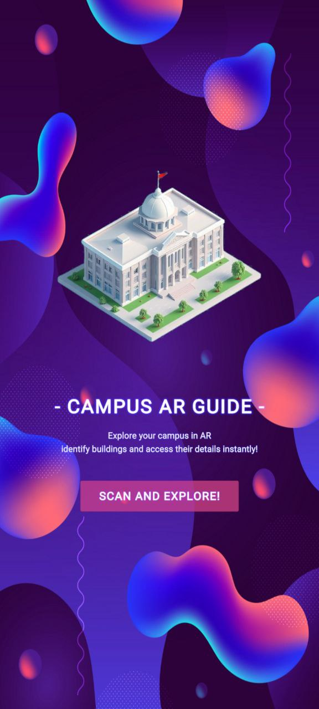
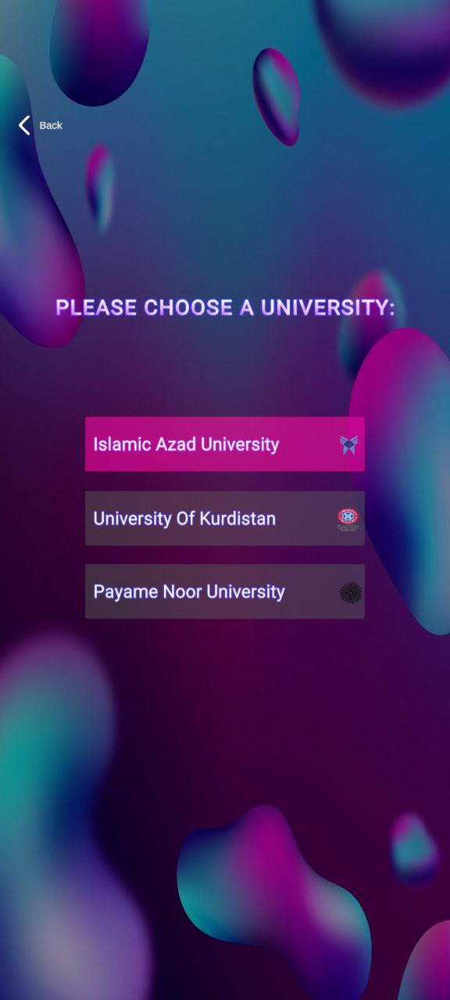

# 🏛️ ARchitect — AR App for Building Recognition

An Augmented Reality mobile application that identifies university buildings using YOLOv8 and displays real-time information using AR overlays.

🎓 This was my Bachelor's Capstone Project in IT Engineering, developed over two months.

---

## 🔍 How It Works

1. User opens the app and navigates to the AR screen.
2. The mobile camera scans a building.
3. A screenshot is sent to a Flask backend.
4. YOLOv8 processes the image and identifies the building.
5. Unity overlays the building’s information in AR on the live camera feed.

---

## 🧠 Technologies Used

- Unity 3D (for AR interface and UI)
- YOLOv8 (trained via Roboflow)
- Python Flask API (backend server)
- Google Colab (for training and fine-tuning the model)
- Computer Vision
- Image Processing

---

## 🚀 Getting Started

### 1. Clone the Repository
```bash
git clone https://github.com/Bita-Batmani/ARchitect.git
cd ARchitect
```

### 2. Flask Backend Setup
Navigate to the `FlaskServer` directory and install dependencies:

```bash
cd FlaskServer
pip install -r requirements.txt
```

Run the server:

```bash
python app.py
```

Make sure your Unity app points to the correct local or remote IP of the backend.

---

## 📁 Project Structure

```
ARchitect/
│
├── UnityApp/                 # Unity project files
├── FlaskServer/              # Flask backend with YOLOv8 model
│   ├── app.py                # Main Flask server
│   ├── yolov8_model/         # YOLOv8 weights/config
│   └── requirements.txt
├── Screenshots/              # App screenshots
└── README.md
```

---

## 📸 Screenshots




---

## 🙏 Acknowledgments

Thanks to my supervisor for their valuable guidance and to my university for supporting this project.

---

## 📎 GitHub Repository

[🔗 https://github.com/Bita-Batmani/ARchitect](https://github.com/Bita-Batmani/ARchitect-FinalUniProject)

---

## 📬 Contact

📧 bitabatmani20@gmail.com  
💼 [LinkedIn Profile](https://www.linkedin.com/in/bita-batmani/)

---

## 📌 Tags

`#AugmentedReality` `#Unity3D` `#YOLOv8` `#ComputerVision` `#BachelorProject` `#Flask` `#ARdevelopment` `#GitHubProjects`
